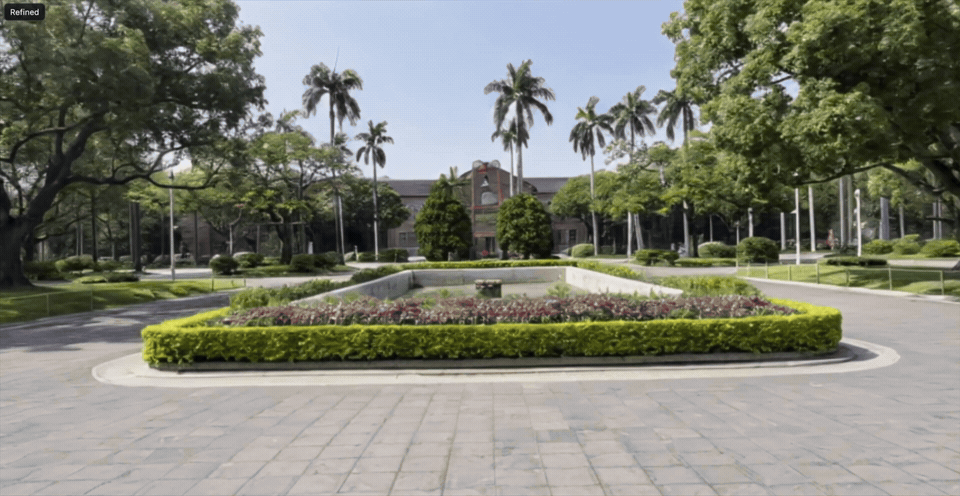

# 3DGS Web Viewer

Headless-server friendly Web viewer for interactive 3D Gaussian Splatting
rendering and optional Difix3D+ refinement.

The application runs as a FastAPI server with a browser-based frontend. Camera
movement requests low-resolution raw renders for responsiveness; after the
camera is idle, the frontend requests a higher-resolution render and refinement.
If CUDA, `gsplat`, a scene file, or a Difix3D+ adapter is unavailable, the server
falls back gracefully instead of requiring a desktop GUI stack.



Report: [assets/paper/report.pdf](assets/paper/report.pdf)

## Requirements

- Python 3.10 or newer
- CUDA-capable PyTorch and `gsplat` only when using the real renderer
- A 3DGS `.ply` scene file for real rendering
- Difix3D+ only when enabling refinement adapters

## Setup

```bash
conda create -n 3dgs-web python=3.10 -y
conda activate 3dgs-web
pip install -e ".[dev]"
```

This baseline setup is enough to run the Web app, API, tests, mock renderer,
and fallback refiner. It does not install CUDA rendering or Difix3D inference
dependencies.

For the optional `gsplat` renderer, install a CUDA-enabled PyTorch build that
matches the server first, then install the extra dependencies:

```bash
pip install -e ".[dev,gsplat]"
```

## Scene Assets

Large `.ply` scene files are not tracked by this repository. The `data/`
directory is kept in git with `.gitkeep`, while `data/*.ply` is ignored.

Project scene assets can be downloaded from the release page:
[https://github.com/Leoxu3/3dgs-web/releases/tag/report-assets-v1](https://github.com/Leoxu3/3dgs-web/releases/tag/report-assets-v1).

Place scene files under `data/`, for example:

```text
data/center_post.ply
data/center_post_30.ply
data/pool.ply
```

You can select a scene at startup with `SCENE_PLY_PATH` or change it from the
Web UI. Relative paths are resolved from the repository root and must point to
an existing `.ply` file.

## Run

```bash
./scripts/run_dev.sh
```

By default, the server listens on `0.0.0.0:8000` and enables Uvicorn reload.
Open `http://localhost:8000` locally, or use SSH tunneling when running on a
remote server.

Common environment variables:

```bash
APP_HOST=0.0.0.0
APP_PORT=8000
APP_RELOAD=1

SCENE_PLY_PATH=data/center_post.ply
RENDERER_BACKEND=auto   # auto, gsplat, mock
GSPLAT_DEVICE=cuda      # cuda, cuda:0, ...

REFINER_BACKEND=auto    # auto, adapter, fallback
```

`RENDERER_BACKEND=auto` tries the CUDA `gsplat` renderer when the optional
dependencies are available and uses `MockRenderer` otherwise. If the UI reports
a fallback caused by a partially loaded `gsplat` package, verify
`torch.cuda.is_available()`, the CUDA toolkit or matching wheel, and reinstall
or rebuild `gsplat`.

To verify the baseline setup:

```bash
pytest

APP_PORT=8765 APP_RELOAD=0 ./scripts/run_dev.sh
curl http://127.0.0.1:8765/api/health
```

Without the optional renderer and refiner dependencies, `/api/health` should
report `mock-svg-renderer`, `fallback-refiner`, and `fallback_mode: true`.

## Difix3D+ Refinement

The backend does not hard-code one Difix3D+ entrypoint. Refinement is configured
through an adapter and remains optional.

- `REFINER_BACKEND=auto` uses a configured adapter when present; otherwise it
  returns the input image unchanged.
- `REFINER_BACKEND=adapter` requires one adapter configuration and reports
  adapter failures as fallback mode.
- `REFINER_BACKEND=fallback` always uses the no-op fallback refiner.

Recommended worker setup for interactive demos:

```bash
git clone https://github.com/nv-tlabs/Difix3D.git /path/to/Difix3D
cd /path/to/Difix3D
pip install -r requirements.txt

cd /path/to/Computer_Graphics/3dgs-web
export REFINER_BACKEND=adapter
export DIFIX3D_REPO=/path/to/Difix3D
export DIFIX3D_MODEL_NAME=nvidia/difix
export DIFIX3D_TIMEOUT_SECONDS=180
export DIFIX3D_WORKER_COMMAND='python scripts/difix3d_hf_worker.py'
export APP_RELOAD=0
./scripts/run_dev.sh
```

When the frontend loads, it calls `/api/refiner/warmup`. With
`DIFIX3D_WORKER_COMMAND`, this starts a persistent worker and performs one dummy
inference at the current idle render size before the first visible refinement.
If Difix3D is installed in another environment, point the adapter at that
Python executable:

```bash
export DIFIX3D_PYTHON=/path/to/miniconda3/envs/difix3d/bin/python
```

Supported adapter configuration options:

```bash
export REFINER_BACKEND=adapter
export DIFIX3D_REPO=/path/to/Difix3D

# Persistent Hugging Face worker.
export DIFIX3D_WORKER_COMMAND='python scripts/difix3d_hf_worker.py'

# One-shot Hugging Face adapter.
export DIFIX3D_COMMAND='python scripts/difix3d_hf_adapter.py --input {input} --output {output} --camera {camera}'

# Local checkpoint / upstream inference_difix.py compatibility adapter.
export DIFIX3D_MODEL_PATH=/path/to/Difix3D/checkpoints/model.pkl
export DIFIX3D_COMMAND='python scripts/difix3d_plus_adapter.py --input {input} --output {output} --camera {camera}'

# Python callable adapter.
export DIFIX3D_PYTHON_CALLABLE='my_difix_adapter:refine_image'
```

If multiple adapter entries are set, the backend tries
`DIFIX3D_PYTHON_CALLABLE`, then `DIFIX3D_WORKER_COMMAND`, then
`DIFIX3D_COMMAND`. CLI commands receive `{input}`, `{output}`, `{camera}`, and
`{variant}` placeholders; the command must write the refined image to
`{output}`.

Useful Difix3D tuning variables:

```bash
DIFIX3D_PROMPT='remove degradation'
DIFIX3D_VARIANT=difix3d_plus
DIFIX3D_TIMESTEP=199
DIFIX3D_NUM_INFERENCE_STEPS=1
DIFIX3D_GUIDANCE_SCALE=0.0
DIFIX3D_MAX_SIDE=512
DIFIX3D_HEIGHT=0
DIFIX3D_WIDTH=0
DIFIX3D_DEVICE=cuda
DIFIX3D_SEED=42
DIFIX3D_REF_IMAGE=/path/to/reference.png
DIFIX3D_LOCAL_FILES_ONLY=1
```

## Benchmarking

Start the server first, then collect timing samples through the HTTP API:

```bash
./scripts/run_dev.sh

python scripts/benchmark_render_modes.py \
  --base-url http://127.0.0.1:8000 \
  --samples 100 \
  --discard 10 \
  --output benchmark_render_modes.csv
```

The CSV includes moving raw render, idle raw render, and idle render+refine
samples. The first `--discard` samples are written to the CSV but excluded from
the printed summary.

## Tests

```bash
pytest
```

## Related Repositories  
This project builds upon the following open-source projects:
1. Nerfstudio: https://github.com/nerfstudio-project/nerfstudio
2. Difix3D+: https://github.com/nv-tlabs/Difix3D
3. gsplat: https://github.com/nerfstudio-project/gsplat